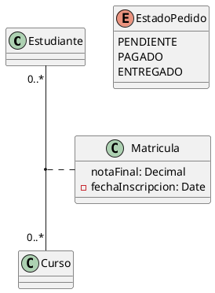
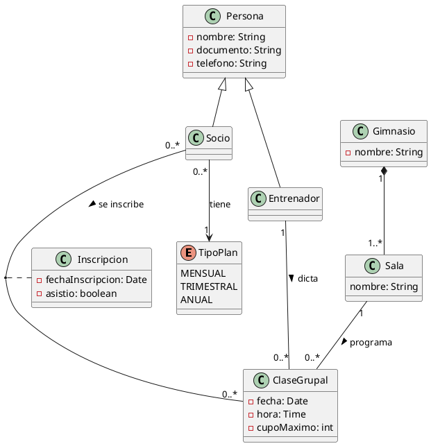

# Taller: Diagramas de Clases

---

## 1. Conceptos

### 1.1 Clase y objeto

- **Clase:** el molde. Dice qué datos y qué acciones tienen las cosas de ese tipo.
- **Objeto:** una cosa concreta creada con ese molde.
- **Diagrama de objetos:** muestra ejemplos reales con valores. Sirve para comprobar que el diagrama de clases permite esos casos.
- **Ejemplo:** clase Automóvil. Objetos: un Toyota blanco con placa ABC123 y un Mazda negro con placa XYZ789.

### 1.2 Modelo de dominio y modelo de diseño

El modelo de dominio dibuja los conceptos del negocio, sin detalles técnicos. El diagrama de diseño es lo mismo más los detalles necesarios para programar.

| Elemento | ¿Dónde va? | Por qué |
| --- | --- | --- |
| Pedido con sus atributos | Dominio (y también diseño) | Es un concepto del negocio. En diseño se le añaden tipos y visibilidad. |
| +calcularTotal(): Decimal | Diseño | Es un método, o sea, un detalle de programación. |
| PedidoController / PedidoRepository | Diseño | Son piezas técnicas que el negocio no conoce. |
| Visibilidad + / - | Diseño | Es una decisión de implementación. |
| Multiplicidad Cliente–Pedido | Ambos | Es una regla del negocio y también guía el código. |

### 1.3 ¿Atributo o clase?

- Si es un dato simple sin datos propios, es **atributo**. Ejemplo: el nombre de una Persona.
- Si tiene datos propios, se comparte o se relaciona con otras clases, es **clase**. Ejemplo: Dirección con calle, ciudad y código postal, usada por varios clientes.

---

## 2. Relaciones y multiplicidad

### 2.1 Asociación y dependencia

- **Asociación (línea simple):** una clase guarda a otra de forma permanente, como un atributo.
- **Dependencia (flecha punteada):** una clase solo usa a otra por un momento, por ejemplo como parámetro de un método.
- La línea simple es la notación equivocada cuando no hay relación permanente, solo uso temporal.

```plantuml
Cliente -- Pedido            ' asociacion
Pedido ..> ServicioDescuento  ' dependencia
```

### 2.2 Agregación y composición

Criterio del ciclo de vida: ¿las partes siguen existiendo si el todo desaparece?

- **Composición (rombo lleno):** no. Ejemplo propio: una Factura y sus líneas de factura; si se elimina la factura, sus líneas dejan de tener sentido. También Gimnasio–Sala, del ejercicio.
- **Agregación (rombo vacío):** sí. Ejemplo propio: una Biblioteca y sus Libros; si la biblioteca cierra, los libros siguen existiendo en otro lugar.
- **Opinión de Fowler:** dice que la agregación es ambigua y casi no aporta nada a la asociación simple. Por eso muchos autores usan composición (cuando el ciclo de vida está atado) o asociación simple (en cualquier otro caso).

### 2.3 Herencia

La herencia está bien usada solo si se cumple "X es un tipo de Y" y X puede usarse en cualquier lugar donde se espera Y.

- **Bien usada:** Animal → Perro (un perro es un tipo de animal).
- **Mal usada:** Pedido y Factura heredan de una misma clase solo porque ambas tienen el campo fecha. Compartir un campo no basta.
- **Sin herencia:** cada clase tiene su propio atributo fecha. Si lo compartido tiene sentido propio, se crea una clase aparte y se relaciona por asociación o composición.

### 2.4 Clase de asociación y enumeración

- **Clase de asociación:** aparece en una relación muchos a muchos con datos propios. Esos datos no son de ninguno de los dos lados, sino de la relación.
- **Enumeración:** lista fija de valores. Es mejor que un String porque evita errores de escritura y valores inválidos. Es mejor que una clase cuando los valores no tienen datos propios.



### 2.5 Leer multiplicidades

| Relación | Lectura en los dos sentidos |
| --- | --- |
| Pedido – Línea de pedido | Un pedido tiene una o muchas líneas. Cada línea pertenece a un solo pedido. |
| Estudiante – Curso | Un estudiante puede estar en cero o muchos cursos. Un curso puede tener cero o muchos estudiantes. |
| Persona – Pasaporte | Una persona tiene cero o un pasaporte. Cada pasaporte pertenece a una sola persona. |

La que necesita clase de asociación es **Estudiante – Curso**: es muchos a muchos y la nota final es de ese estudiante en ese curso, no del estudiante ni del curso por separado.

---

## 3. Ejercicio corto: el gimnasio

### 3.1 Sustantivos del texto

| Clasificación | Sustantivos |
| --- | --- |
| Clase | Gimnasio, Sala, ClaseGrupal, Entrenador, Socio, Inscripción, Persona |
| Atributo | fecha, hora, cupoMáximo (de ClaseGrupal); fechaInscripción, asistió (de Inscripción); nombre, documento, teléfono (de Persona) |
| Enumeración | TipoPlan (mensual, trimestral, anual) |

Se descartan **sede** (es el mismo Gimnasio) y **sistema** (no es parte del negocio).

### 3.2 Modelo de dominio


### 3.3 Respuestas de una línea

| Pregunta | Respuesta |
| --- | --- |
| ¿Inscripción? | Es una clase de asociación: une Socio y ClaseGrupal (muchos a muchos) y guarda datos propios (fecha y asistencia). |
| ¿Herencia justificada? | Sí: Persona → Socio y Persona → Entrenador, porque ambos son personas y comparten nombre, documento y teléfono. |
| ¿Plan es clase o enumeración? | Enumeración: son solo tres valores fijos sin datos propios. |
| ¿Y si cada plan tuviera un precio que el gimnasio actualiza? | Pasaría a ser clase (Plan con nombre, precio y duración), porque ya tendría datos que cambian, y Socio se asociaría a ella. |

---

## Código PlantUML del modelo

