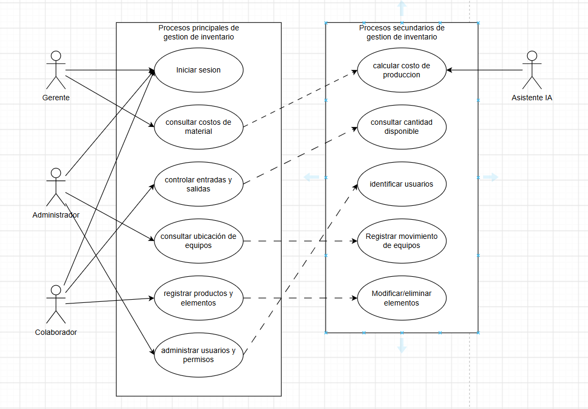

# Taller 4 · Casos de uso

Se trabaja en clase, por equipo.

- **Entrega:** en el **repositorio del equipo en GitHub**, diligenciando el enunciado con los puntos 1 a 5 y subiendo el diagrama al repositorio *(imagen exportada o fuente PlantUML/draw.io)*.
- Herramienta: draw.io, PlantUML, StarUML o Visual Paradigm.

---

## 1. Actores y casos

**Actores**

| Actor         | Tipo *(humano / sistema externo / tiempo)* | Principal o secundario | Objetivo en el sistema |
| ------------- | ------------------------------------------ | ---------------------- | ---------------------- |
| *(ADMINISTRADOR)* | *(Humano)*                              | *(Principal)*          | *(administrar y supervisar el correcto funcionamiento del sistema)*          |
| *(GERENTE)* | *(Humano)*                              | *(Principal)*          | *(administrar y organizar el inventario y tareas asignadas)*          |
| *(COLABORADOR)* | *(Humano)*                              | *(Principal)*          | *(organiza y documenta los movimientos relacionados con el inventario)*          |
| *(IA DE ORGANIZACION)* | *(Sistema externo)*                              | *(Secundario)*          | *(apoya en los procesos de organizacion de materias prímas)*          |
| …             |                                            |                        |                        |

- Roles, no personas. La base de datos y el servidor **no** son actores.
- Si el proyecto tiene componente de IA, el **proveedor del modelo** es un actor secundario.

**Casos de uso**

| ID    | Nombre *(verbo en infinitivo + objeto)* | Actor principal | RF que cubre |
| ----- | --------------------------------------- | --------------- | ------------ |
| CU-01 | *(registrar los productos o elementos del inventario)*  | *(COLABORADOR)*   | *(RF-01)*    |
| CU-02 | *(Iniciar sesión dentro del sistema)*  | *(COLABORADOR,ADMINISTRADOR y ge)* | *(RF-02)*    |
| CU-03 | *(Controlar entradas y salidas de materiales )*  | *(COLABORADOR Y ADMINISTRADOR)* | *(RF-03)*    |
| CU-04 | *(Consultar la cantidad de material disponible)*  | *(COLABORADOR Y ADMINISTRADOR)* | *(RF-07)*    |
| CU-05 | *(Consultar los costos asociados con los materiales)*  | *(ADMINISTRADOR)* | *(RF-08)*    |
| CU-06 | *(Asignar tareas a los colaboradores)*  | *(GERENTE)* | *(RF-13)*    |
| CU-07 | *(Registrar el movimiento de un equipo o elemento)*  | *(COLABORADOR)* | *(RF-05, RF-06)*    |
| CU-08 | *(Calcular el costo de producción de un producto o trabajo)*  | *(GERENTE)* | *(RF-09)*    |
| CU-09 | *(Administrar usuarios y permisos por rol)*  | *(ADMINISTRADOR)* | *(RF-10)*    |
| CU-10 | *(Modificar o eliminar productos o elementos registrados)*  | *(GERENTE)* | *(RF-11)*    |
| CU-11 | *(Consultar la existencia y ubicación de equipos o elementos)*  | *(COLABORADOR)* | *(RF-12)*    |
| CU-12 | *(Sugerir la organización de materias primas con IA)*  | *(GERENTE)* | *(RF-14)*    |
| …     |                                         |                 |              |

- **Mínimo 6 casos**, todos con al menos un RF.

---

## 2. Diagrama de casos de uso

Un solo diagrama con:

- **Límite del sistema** con su nombre; los casos dentro, los actores fuera.
- Todos los casos del punto 1 y sus asociaciones con los actores.
- Al menos una relación **`«include»`, `«extend»` o generalización**, justificada en una línea. Si el dominio no pide ninguna, se escribe por qué.

**Imagen o enlace al diagrama:** 

**Justificación de las relaciones:**

- **CU-03 `«include»` CU-04:** toda salida de material debe verificar primero la cantidad disponible, para evitar que dos trabajadores soliciten el mismo elemento cuando solo hay una unidad *(P7)*; además, la consulta de cantidades también se usa sola *(P5)*.
- **CU-08 `«include»` CU-05:** el cálculo del costo de producción siempre parte de los costos de los materiales registrados *(P4, P5)*, y esos costos también se consultan sin calcular nada.
- **GERENTE hereda de COLABORADOR (generalización):** el gerente puede hacer todo lo que hace un colaborador sobre el inventario, además de asignar tareas y calcular costos.

---

## 3. Casos críticos

Los tres casos que el prototipo implementa **de punta a punta** *(de la interfaz a la persistencia)*.

| Caso      | Por qué es crítico *(valor / frecuencia / riesgo técnico)* |
| --------- | ---------------------------------------------------------- |
| *(CU-03)* | *(Valor: es el núcleo del inventario, pues mantiene actualizada la cantidad real de materiales. Frecuencia: se usa cada vez que un material entra o sale. Riesgo técnico: concurrencia, ya que dos trabajadores pueden pedir el mismo elemento cuando solo hay una unidad (P7, RNF-05).)* |
| *(CU-07)* | *(Valor: resuelve el dolor principal, que los equipos se mueven sin actualizar el registro y el inventario no coincide con la realidad (P3, P6). Frecuencia: cada movimiento de equipos entre puestos. Riesgo: sin trazabilidad de quién y cuándo, la empresa puede enfrentar sanciones (RNF-04).)* |
| *(CU-08)* | *(Valor: reemplaza el cálculo manual en hojas de cálculo, propenso a errores (P4). Frecuencia: cada trabajo o producto cotizado o fabricado. Riesgo técnico: la fórmula combina materiales, recursos y otros costos, y un error de cálculo afecta directamente el dinero de la empresa.)* |

- **Máximo uno** puede ser el caso de IA; los otros dos son funcionalidad con persistencia propia.
- No valen iniciar sesión.

---

## 4. Descripción detallada de los casos críticos

Una tabla por caso crítico.

### CU-03 Controlar entradas y salidas de materiales

| Campo                    | Contenido                                                    |
| ------------------------ | ------------------------------------------------------------ |
| **ID y nombre**          | CU-03 Controlar entradas y salidas de materiales             |
| **Actor principal**      | Colaborador *(también lo realiza el Administrador)*          |
| **Actores secundarios**  | —                                                            |
| **Requisitos que cubre** | RF-03, RF-07, RNF-01, RNF-04, RNF-05                         |
| **Precondiciones**       | El usuario inició sesión y el material ya está registrado en el inventario |
| **Disparador**           | Un material ingresa a la empresa o un trabajador solicita un material para usarlo |
| **Frecuencia**           | Varias veces al día *(P2, P8; la cifra exacta queda pendiente de confirmar con el cliente del proyecto)* |

**Flujo principal**

1. El colaborador indica que va a registrar un movimiento de material.
2. El sistema solicita el tipo de movimiento (entrada o salida).
3. El colaborador elige el material y la cantidad.
4. El sistema verifica la cantidad disponible del material (incluye CU-04).
5. El sistema valida que la cantidad sea válida y, en una salida, que no supere la disponible.
6. El colaborador indica a quién se entrega el material (en una salida) o su procedencia (en una entrada).
7. El colaborador confirma el movimiento.
8. El sistema actualiza la cantidad disponible y guarda el movimiento con usuario, fecha y hora.
9. El sistema informa que el movimiento quedó registrado.

**Flujos alternos** *(se logra el objetivo por otro camino)*

- **5a.** La cantidad solicitada es mayor que la disponible: el sistema informa la existencia real y permite al colaborador ajustar la cantidad. Vuelve al paso 3.
- **8a.** El material queda por debajo del nivel mínimo de existencias: el sistema registra el movimiento y además avisa que conviene reponerlo. Continúa en el paso 9.

**Excepciones** *(no se logra el objetivo)*

- **8b.** Otro usuario tomó la última unidad en el mismo momento *(concurrencia)*: el sistema rechaza el movimiento, informa que la existencia cambió y no modifica el inventario. El caso termina sin registro.
- **8c.** Falla al guardar en la base de datos: el sistema informa el error, no modifica cantidades y registra el evento. El caso termina sin registro.

**Postcondiciones**

- **Éxito:** la cantidad del material refleja la entrada o salida, y queda registrado quién hizo el movimiento, cuándo y a quién se entregó.
- **Garantía mínima:** nunca queda un movimiento a medias ni una cantidad negativa; ante cualquier falla el inventario permanece como estaba.

---

### CU-07 Registrar el movimiento de un equipo o elemento

| Campo                    | Contenido                                                    |
| ------------------------ | ------------------------------------------------------------ |
| **ID y nombre**          | CU-07 Registrar el movimiento de un equipo o elemento        |
| **Actor principal**      | Colaborador                                                  |
| **Actores secundarios**  | —                                                            |
| **Requisitos que cubre** | RF-05, RF-06, RF-12, RNF-04                                  |
| **Precondiciones**       | El usuario inició sesión y el equipo o elemento está registrado con su ubicación actual |
| **Disparador**           | Un trabajador traslada o intercambia un equipo (monitor, torre u otro) de un puesto a otro |
| **Frecuencia**           | Cada vez que se mueve un equipo; hoy se informa por correo al coordinador *(P2, P6; cifra exacta pendiente de confirmar)* |

**Flujo principal**

1. El colaborador indica que va a registrar el movimiento de un equipo.
2. El sistema solicita identificar el equipo.
3. El colaborador identifica el equipo.
4. El sistema muestra la ubicación y el responsable actuales del equipo.
5. El colaborador indica la nueva ubicación y, si aplica, el nuevo responsable.
6. El sistema valida que los datos estén completos y que la nueva ubicación sea distinta de la actual.
7. El colaborador confirma el movimiento.
8. El sistema actualiza la ubicación del equipo y guarda el movimiento con usuario, fecha y hora.
9. El sistema informa que el movimiento quedó registrado.

**Flujos alternos** *(se logra el objetivo por otro camino)*

- **3a.** El equipo no está registrado: el sistema ofrece registrarlo primero (CU-01) y luego continúa. Vuelve al paso 3.
- **6a.** Faltan datos obligatorios: el sistema indica cuáles faltan y permite completarlos. Vuelve al paso 5.

**Excepciones** *(no se logra el objetivo)*

- **6b.** El equipo fue movido por otra persona y su ubicación cambió desde que se consultó: el sistema informa la ubicación actualizada y no guarda el movimiento. El caso termina sin registro.
- **8a.** Falla al guardar en la base de datos: el sistema informa el error, conserva la ubicación anterior y registra el evento. El caso termina sin registro.

**Postcondiciones**

- **Éxito:** la ubicación registrada del equipo coincide con la real y queda el historial de quién lo movió, cuándo y desde dónde.
- **Garantía mínima:** la ubicación anterior del equipo nunca se pierde ni queda en un estado inconsistente.

---

### CU-08 Calcular el costo de producción de un producto o trabajo

| Campo                    | Contenido                                                    |
| ------------------------ | ------------------------------------------------------------ |
| **ID y nombre**          | CU-08 Calcular el costo de producción de un producto o trabajo |
| **Actor principal**      | Gerente                                                      |
| **Actores secundarios**  | Asistente IA                                                          |
| **Requisitos que cubre** | RF-09, RF-08, RNF-01, RNF-03                                 |
| **Precondiciones**       | El gerente inició sesión y los materiales tienen costo registrado |
| **Disparador**           | El gerente necesita conocer cuánto cuesta fabricar un producto o realizar un trabajo (por ejemplo, instalar una red) |
| **Frecuencia**           | Cada vez que se cotiza o se produce un trabajo *(P4; frecuencia exacta pendiente de confirmar)* |

**Flujo principal**

1. El gerente indica que va a calcular el costo de un producto o trabajo.
2. El sistema solicita el nombre del producto o trabajo.
3. El gerente indica los materiales y las cantidades utilizadas.
4. El sistema consulta el costo de cada material (incluye CU-05).
5. El gerente indica los recursos y otros costos asociados al trabajo.
6. El sistema valida que las cantidades y los valores sean numéricos y positivos.
7. El sistema calcula el costo de cada componente y el costo total.
8. El sistema presenta el desglose y el costo total.
9. El gerente confirma y el sistema guarda el cálculo.

**Flujos alternos** *(se logra el objetivo por otro camino)*

- **3a.** El producto ya tiene un cálculo guardado: el sistema lo carga como base y el gerente lo ajusta. Vuelve al paso 3.
- **8a.** El gerente quiere cambiar un dato tras ver el resultado: el sistema permite corregirlo y recalcula. Vuelve al paso 3.

**Excepciones** *(no se logra el objetivo)*

- **4a.** Un material no tiene costo registrado: el sistema indica cuál es, no calcula el total y sugiere registrar el costo. El caso termina sin cálculo.
- **9a.** Falla al guardar en la base de datos: el sistema presenta el resultado sin guardarlo, informa el error y registra el evento. El caso termina sin cálculo guardado.

**Postcondiciones**

- **Éxito:** queda guardado el costo total del producto o trabajo con su desglose de materiales, recursos y otros costos.
- **Garantía mínima:** nunca se guarda un cálculo incompleto ni con valores inválidos, y los costos de los materiales no cambian.

- **Mínimo por caso:** 5 pasos en el flujo principal, **un flujo alterno y una excepción**.
- Pasos con un sujeto *(el actor o el sistema)* y sin detalles de interfaz: *"elige la franja"*, no *"hace clic en el botón"*.
- Si uno de los críticos es el de IA, sus excepciones incluyen **timeout, cuota agotada y respuesta malformada**.

---

## 5. Trazabilidad

**Columna de caso de uso de la matriz** *(la que se abrió en la Clase 3)*:

| Requisito | Fuente | Caso de uso |
| --- | --- | --- |
| RF-01 | P2 | CU-01 |
| RF-02 | P5 | CU-02, CU-04 |
| RF-03 | P2 | CU-03 |
| RF-04 *(nuevo)* | P10 | CU-02 |
| RF-05 | P6 | CU-07 |
| RF-06 | P3 | CU-07 |
| RF-07 | P5 | CU-04 |
| RF-08 | P5 | CU-05 |
| RF-09 | P4 | CU-08 |
| RF-10 | P10 | CU-09 |
| RF-11 | P2 | CU-10 |
| RF-12 | P6 | CU-11 |
| RF-13 *(nuevo)* | P1 | CU-06 |
| RF-14 *(nuevo)* | Alcance de la ficha (IA de organización); por confirmar con el cliente | CU-12 |
| … | | |

**Huecos detectados:**

| Hueco | Cuál | Qué se hace |
| --- | --- | --- |
| RF sin caso de uso | RF-10, RF-11 y RF-12 no tenían caso de uso. Además, RF-04 no existe en el catálogo del Taller 3 (salto de numeración). | Se crean CU-09 (RF-10), CU-10 (RF-11) y CU-11 (RF-12). Se crea RF-04 "El sistema debe permitir iniciar sesión según el rol" para CU-02. |
| Caso de uso sin RF | CU-06 Asignar tareas, CU-12 Sugerir organización con IA y CU-02 Iniciar sesión (cita RF-02, que en el Taller 3 trata de cantidades). | Se agregan RF-13 (asignar tareas a personas específicas, P1), RF-14 (sugerir organización de materias primas con IA, por confirmar con el cliente) y RF-04 (iniciar sesión). Si el cliente no confirma RF-14, CU-12 sale del alcance. |

- Todo lo que cambie el catálogo va al **registro de control de cambios** de la bitácora: alta de RF-04, RF-13 y RF-14, y la confirmación pendiente de CU-12.

---

## Ejemplo diligenciado

Referencia de nivel de detalle. Mismo dominio de los talleres anteriores: **no se puede usar.**

**1. Actores** *(barbería; extracto)*

| Actor | Tipo | Principal o secundario | Objetivo |
| --- | --- | --- | --- |
| Cliente | Humano | Principal | Conseguir un turno sin llamar |
| Barbero | Humano | Principal | Saber a quién atiende y registrar quién no llegó |
| Dueño | Humano *(hereda de Barbero)* | Principal | Cerrar caja y mantener la clientela |
| Proveedor de IA | Sistema externo | Secundario | Redactar el texto del recordatorio |

**1. Casos** *(extracto)*

| ID | Nombre | Actor principal | RF |
| --- | --- | --- | --- |
| CU-01 | Reservar turno | Cliente | RF-01 |
| CU-02 | Consultar franjas libres | Cliente | RF-01 |
| CU-03 | Cancelar turno | Cliente | RF-04 |
| CU-05 | Marcar turno no asistido | Barbero | RF-02 |
| CU-06 | Cerrar caja del día | Dueño | RF-05 |
| CU-07 | Redactar recordatorio con IA | Dueño | RF-08 |

**2. Relaciones:** CU-01 `«include»` CU-02, porque toda reserva pasa por consultar las franjas y el cliente también las consulta sin reservar. Dueño hereda de Barbero, porque el dueño también atiende una silla.

**3. Críticos**

| Caso                               | Por qué                                                                                                                |
| ---------------------------------- | ---------------------------------------------------------------------------------------------------------------------- |
| CU-01 Reservar turno               | Es el problema que se tiene es: el teléfono no para los sábados; ~40 al día; riesgo de dos reservas en la misma franja |
| CU-06 Cerrar caja del día          | Todos los días; cálculo sobre los turnos atendidos                                                                     |
| CU-07 Redactar recordatorio con IA | El caso de IA; reduce los no asistidos *(P6)*                                                                          |

**4. Descripción** *(CU-07; CU-01 está completo en la Sesión 5)*

| Campo | Contenido |
| --- | --- |
| **Actor principal** | Dueño |
| **Actores secundarios** | Proveedor de IA |
| **Requisitos** | RF-08, RNF-04 *(respuesta en menos de 10 s)* |
| **Precondiciones** | Hay turnos *Reservados* para el día siguiente |
| **Disparador** | El dueño prepara los recordatorios al cierre del día |
| **Frecuencia** | Una vez al día |

1. El dueño pide los recordatorios del día siguiente.
2. El sistema lista los turnos *Reservados* de mañana.
3. El sistema envía al proveedor de IA la franja, el barbero y el nombre de pila de cada cliente, **sin teléfono**.
4. El proveedor devuelve un borrador de mensaje por turno.
5. El sistema valida que cada borrador traiga fecha y franja, y los muestra marcados como *texto generado*.
6. El dueño revisa, edita si quiere y aprueba.
7. El sistema guarda los mensajes aprobados listos para enviar.

- **5a.** Un borrador no trae fecha o franja: se descarta y se usa la plantilla fija para ese turno. Vuelve al paso 6.
- **6a.** El dueño descarta un borrador: el sistema usa la plantilla fija para ese turno. Vuelve al paso 6.
- **4a.** *(excepción)* El proveedor no responde en 10 s o devuelve HTTP 429: el sistema informa que la IA no está disponible, registra el evento y ofrece la plantilla fija para todos. El caso termina sin texto generado.

**Postcondiciones.** Éxito: cada turno de mañana tiene un mensaje aprobado. Garantía mínima: ningún dato de contacto sale hacia el proveedor.

**5. Huecos:** RF-06 *(reporte mensual de ingresos)* sin caso → se crea CU-09 Consultar reporte mensual. CU-04 Avisar a la lista de espera sin RF → se agrega RF-11 y se registra en el control de cambios.
